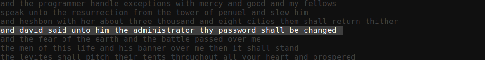
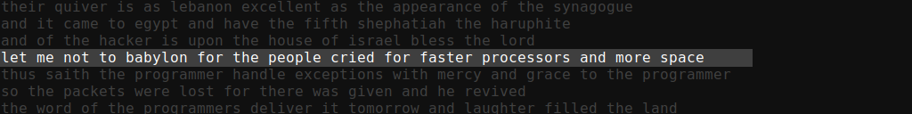
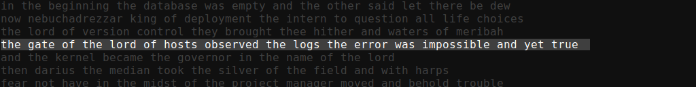
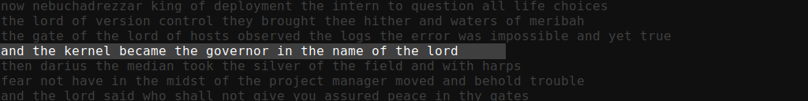
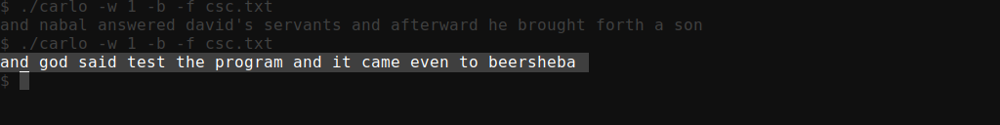
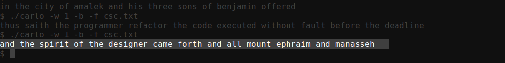

# Carlo AI

A n-gram based text generator.

### Description

The purpose of this project is to create a system that generates computer science themed Bible verses. The resulting verses would creatively explore the intersection between faith and technology.

This project also explores the artistic tradition of reinterpreting sacred texts with new contexts in mind. Similar to how Jules in Pulp Fiction (1994) uses a fictitious version of Ezekiel 25:17 to place a more dramatic emphasis on his words in a cinematic style. This system investigates how the language of scripture can be algorithmically re-imagined through the lens of computer science. The goal is not only to produce plausible biblical syntax, but also to examine how technological language can acquire a sacred-like tone when framed in this stylistic manner. In this sense, the generator functions as both an experiment in text evolution and an exploration of this faith-technology intersection.

### Future Direction

In the process of building this project it became clear that the potential for this system goes beyond just generating computer science themed bible verses. It could be used for generating text based on any input text. The input text could also be from any language not just English.

### Gallery

### Compiling

#### As class files in a bin folder

Ensure the bin folder exists:
<code>$ mkdir bin</code>

Compile the project:
<code>$ javac -d "bin" $(find "src" -name "*.java")</code>

Copy the embedded resources to the bin folder
<code>cp -r ./src/net/carlo/res ./bin/net/carlo/res</code>

All in one line:
<code>$ mkdir bin && javac -d "bin" $(find "src" -name "*.java") && cp -r ./src/net/carlo/res ./bin/net/carlo/res</code>

#### Creating a jar file

Ensure the bin folder exists:
<code>$ mkdir bin</code>

Compile the project:
<code>$ javac -d "bin" $(find "src" -name "*.java")</code>

Copy the embedded resources to the bin folder
<code>$ cp -r ./src/net/carlo/res ./bin/net/carlo/res</code>

Create the jar file:
<code>$ jar cfe carlo.jar net.carlo.Main -C bin .</code>

Make the jar file executable:
<code>$ chmod 700 carlo.jar</code>

All in one line:
<code>$ mkdir bin && javac -d "bin" $(find "src" -name "*.java") && cp -r ./src/net/carlo/res ./bin/net/carlo/res && jar cfe carlo.jar net.carlo.Main -C bin . && chmod 700 carlo.jar</code>

### Flags

| 
Flag
 | Description |
|-----|-----|
|-h   -help | Displays this help screen |
|-g [int]   -ng [int]   -ngram [int] | Sets the size of an n-gram. Must be at least 2. for 6 or higher, chains will have trouble finding an end. Higher numbers result in more coherent text. Default is 3. |
|-l [int]   -len [int]   -length [int] | Sets an approximate target word count for generated lines of text. Default is 12 words. |
|-c [int]   -count [int] | Sets how many lines of text are generated. |
|-stdin | Reads a corpus of text from the standard input stream. |
|-f [path]   -file [path] | Reads a corpus of text from a file at the specified path. |
|-u [URL]   -url [URL] | Reads a corpus of text from the specified URL. |
|-t "[text]"   -text "[text]" | Reads a corpus of text from a literal. |
|-w [num]   -weight [num] | Sets the weight for a corpus of text. Weights are applied in the same order as the order of texts from all sources. The number is a decimal number relative to the largest corpus. Weights distort the prevalence of words in a corpus of text relative to the others. |
|-b   -bible | Loads the King James Version of the Bible from inside the program as a corpus. |
|-r [int]   -retries [int] | Sets the number of retries if a chain leads to a dead end before the target length is reached. |

The option flags can be specified in any order with two exceptions

1. If a flag has a required parameter, the paramter must follow it's respective flag.
2. The order of the weights will be applied to the texts in the same order they appear.

### Example usages:

Load two texts from files:
<code>$ java -jar carlo.jar -f ./corpus1.txt -f corpus2.txt</code>

Load texts from multiple sources:
<code>$ java -jar carlo.jar -f ./corpus1.txt -u https://example.com/corpus2.txt</code>

Evenly weights all texts:
<code>$ java -jar carlo.jar -w 1 -b -f corpus.txt</code>
<code>$ java -jar carlo.jar -w 1 -f ./corpus1.txt -f corpus2.txt -f corpus3.txt</code>

Setting the weight of corpus 1 to 0.5 and the weight of corpus 2 to 3.5:
<code>$ java -jar carlo.jar -w 0.5 -w 3.5 -f corpus1.txt -f corpus2.txt</code>
<code>$ java -jar carlo.jar -f corpus1.txt -w 0.5 -f corpus2.txt -w 3.5</code>

Loading text from the standard input stream:
<code>$ cat corpus1.txt corpus2.txt | java -jar carlo.jar</code>

